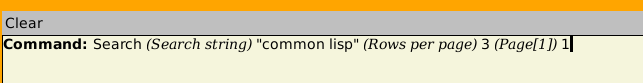
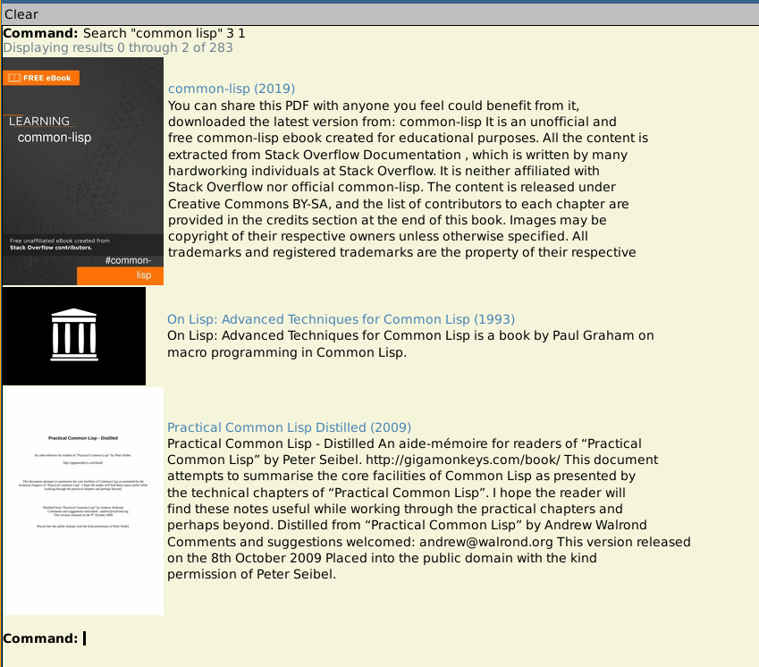
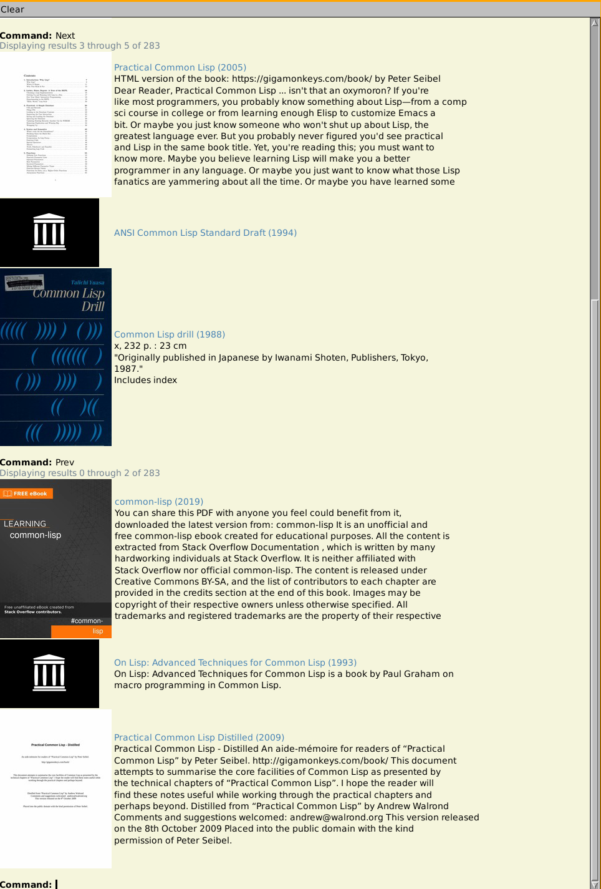
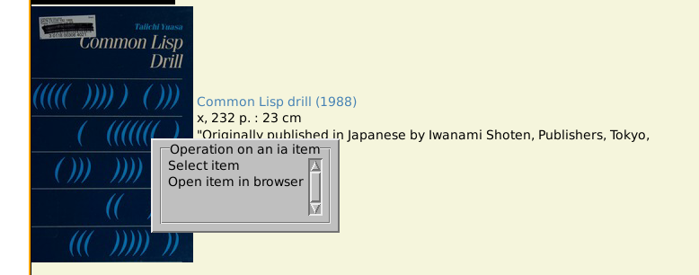

# Internet Archive browser in McCLIM

This will (very simplistically) let you search and open texts on the Internet Archive.

It's a project to re-learn Common Lisp and to teach myself McCLIM, so doubtless the code is absolutely shameful.

## Load/Run

To use, you can either just load via asdf:

```
(require :asdf)
(load "ia-browser.asd")
(asdf:load-system "ia-browser")
```

Or you can do it via symlink and quicklisp:

```
ln -s $PWD $HOME/quicklisp/local-projects/ia-browser
```

```
(ql:quickload "ia-browser")
```

Once you've got it loaded via either method:

```
(ia-browser:ia)
```

## Searching

Use the Search command to run searches. The first argument is the search query (wrap in double quotes for multiple words), the second argument is the number of items per page, and the third argument is the page on which to start.





Use the "Next" and "Prev" commands to page through the search:



Right-click on an item for a context menu of options... currently only "Open item in browser" is of any interest, it'll send the selected item to your web browser where you can actually read the file.


